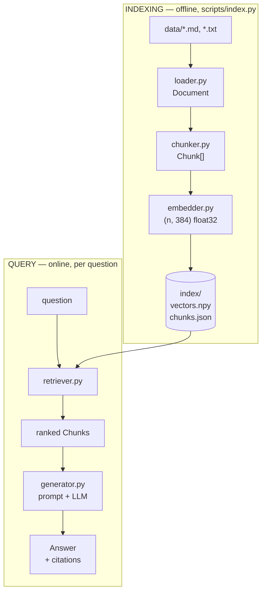
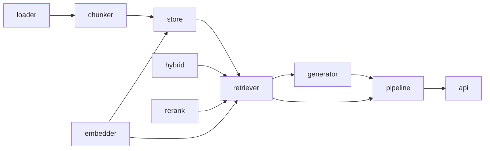
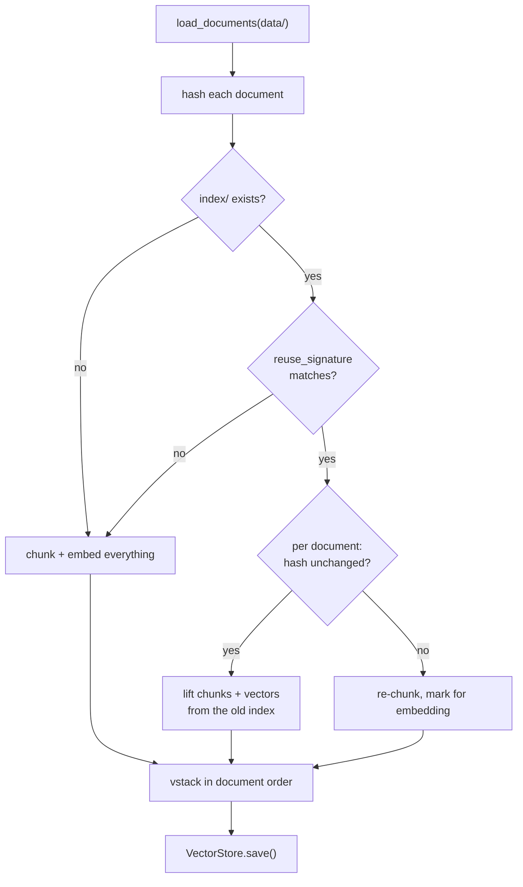
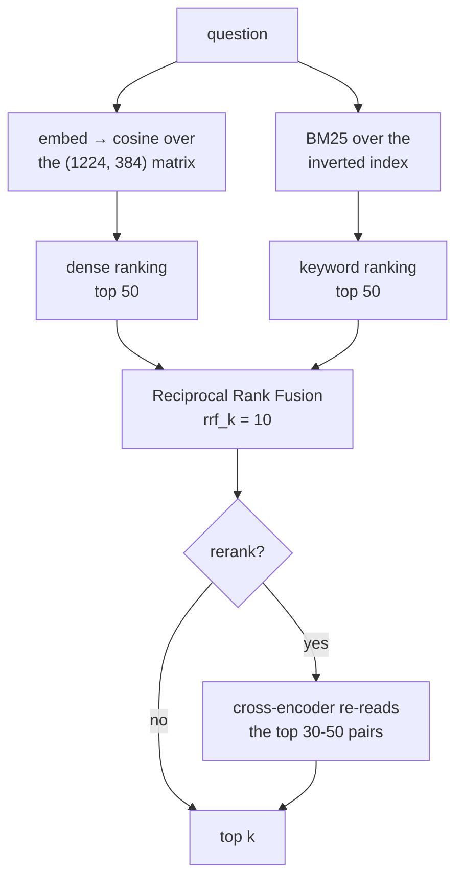
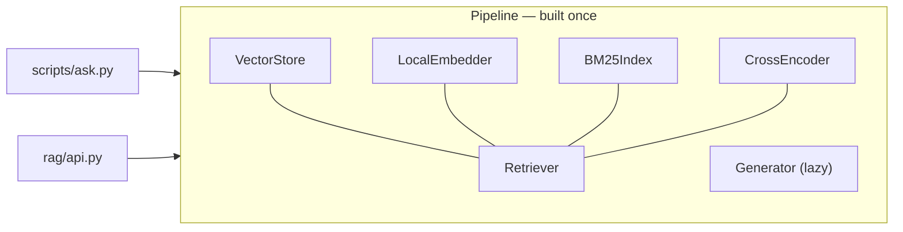

# Architecture

How this project is put together, and why each piece is where it is.

- [README.md](README.md) — what it is and how to run it
- [PLAN.md](PLAN.md) — the build log: what was tried, the numbers, what was wrong
- **this file** — the shape of the code

2,416 lines of Python: 1,614 in `rag/` (the library), 500 in `scripts/` (the
CLIs), 302 in `eval/` (measurement). No LangChain, no LlamaIndex, no vector
database.

---

## 1. The one-paragraph version

There are **two pipelines**, not one, and they meet at a directory on disk.

**Indexing** runs offline: read files → cut into chunks → turn each chunk into
a vector → write `index/vectors.npy` + `index/chunks.json`. **Querying** runs
per question: turn the question into a vector *with the same model*, find the
nearest chunks, re-rank them, paste the winners into a prompt, stream an
answer with citations.

Everything else is detail — but the detail is where retrieval quality lives.



The **seam is the index directory**. Indexing never imports the retriever;
querying never imports the chunker except to reconstruct `Chunk` objects. You
can throw away and rebuild either side independently.

---

## 2. Module map

Read top to bottom — that is roughly dependency order, and roughly the order
the phases built them.

| Module | Lines | Owns | Does *not* know about |
|---|---:|---|---|
| [`loader.py`](rag/loader.py) | 83 | files → `Document`, content hashing | chunking, embeddings |
| [`chunker.py`](rag/chunker.py) | 225 | `Document` → `Chunk[]`, offsets, heading paths | vectors, search |
| [`embedder.py`](rag/embedder.py) | 74 | text → unit-length vectors; the `Embedder` protocol | chunks, storage |
| [`store.py`](rag/store.py) | 163 | persistence, cosine search, index metadata | queries, questions |
| [`hybrid.py`](rag/hybrid.py) | 219 | BM25 + inverted index, Reciprocal Rank Fusion | embeddings entirely |
| [`rerank.py`](rag/rerank.py) | 80 | cross-encoder second stage | how stage 1 found anything |
| [`retriever.py`](rag/retriever.py) | 113 | question → ranked `Result[]`; the 3 modes | prompts, LLMs |
| [`generator.py`](rag/generator.py) | 382 | prompt construction, streaming, citations, cost | retrieval |
| [`pipeline.py`](rag/pipeline.py) | 46 | load everything once, answer many | transport |
| [`api.py`](rag/api.py) | 229 | HTTP, SSE, request validation | retrieval internals |

The dependency graph is a DAG with no cycles and, deliberately, **no framework
at the centre**:



Note what `hybrid.py` does *not* depend on: nothing. BM25 is pure text and
arithmetic — no torch, no model, no network. That is why it costs microseconds
while the dense arm costs a forward pass.

---

## 3. The five data structures

These are the whole contract between modules. Learn them and the code follows.

```python
Document(path, text)              # loader.py — one file, read into memory
  .content_hash                   #   sha256(text) — drives incremental indexing

Chunk(doc_path, chunk_index,      # chunker.py — the unit we embed/retrieve/cite
      start, end, text, prefix)
  .embed_text                     #   prefix + text: what gets EMBEDDED
  .id                             #   "ch07.txt#87": what gets CITED

IndexMeta(model_name, dimension,  # store.py — what built this index
      chunk_size, overlap, strategy, prepend_context,
      min_section, n_chunks, created_at, doc_hashes)
  .reuse_signature                #   the tuple that must match to reuse a vector

Result(chunk, score, rank)        # retriever.py — one retrieved chunk
Answer(question, text, results,   # generator.py — a grounded reply
      cited, hallucinated, *_tokens)
  .citations()                    #   (label, Result) pairs actually used
```

Two subtleties carry real weight:

**`text` vs `embed_text`.** `start`/`end` are offsets into the *real file*, so
a citation is checkable — `sed -n` on the span lands on the actual prose.
`prefix` (a heading path, when enabled) is prepended only for embedding, so it
can help retrieval without corrupting what gets quoted. The two are separate
fields precisely so one cannot leak into the other.

**`score` means three different things.** Cosine similarity in `[-1, 1]` for
dense, an unbounded BM25 score, or a fused RRF score — depending on mode. Only
`rank` is comparable across modes. That is the same fact that dictates how
fusion works (§5).

---

## 4. Indexing, and the caching trap

`scripts/index.py` is 163 lines, and most of them exist to make caching safe.



Only changed documents are re-embedded. Editing one chapter re-embeds 13 of
1,224 chunks in **0.14s**, against **16s** for a full rebuild.

**Why hashes and not mtimes.** `mtime` changes on `git checkout` when nothing
needs re-embedding, and does *not* change when a file is restored in place,
when everything does. Hashing the bytes we actually chunk means "has this work
already been done" is answered by the work's own input.

**Why `reuse_signature` exists.** Caching's dangerous half is knowing when a
cached vector is *no longer valid*. Model, dimension, chunk size, overlap,
strategy, `min_section` and `prepend_context` all change what a chunk's vector
should be. Reuse a vector across a change in any of them and you get a working
index in which some documents were chunked one way and the rest another — no
error, plausible scores, quietly wrong rankings. So the rule is: reuse only
when *every* input matches, else rebuild and say why.

---

## 5. Retrieval: the interesting part

Three modes, and an optional second stage. `--mode` picks the first stage.



### Stage 1a — dense (`store.py`)

The entire search is one line:

```python
scores = self.vectors @ query_vector      # (n, 384) @ (384,) → (n,)
```

Because every vector is L2-normalised at encode time, cosine similarity *is*
the dot product — so the whole thing is one BLAS matrix-vector multiply.
`argpartition` then takes the top k in O(n) rather than sorting all of it.

No approximate-nearest-neighbour index (HNSW, IVF — what FAISS/Qdrant/pgvector
run), because brute force wins below roughly 100k chunks. At 1,224 chunks the
matrix is 1.9 MB and the multiply is sub-millisecond.

### Stage 1b — BM25 (`hybrid.py`)

An inverted index (`term → [(chunk, freq)]`) plus the standard scoring
function. It exists because embeddings are lossy in a *specific* way: a
384-float summary of meaning necessarily discards the rare and the exact —
proper nouns, error codes, quantities. BM25 knows nothing about meaning and
everything about which tokens are rare, so the two fail on **disjoint** sets of
queries. That disjointness is the precondition for fusing them being worth
anything.

BM25 needs no stopword list: "the" appears in nearly every chunk, so its IDF is
~0 and it contributes nothing on its own.

### Fusion — RRF, and why not a weighted sum

```
RRF(chunk) = Σ over rankers of  1 / (k + rank)
```

Cosine lives in `[-1, 1]`; BM25 is unbounded and its scale depends on corpus
size. So `0.6·cosine + 0.4·bm25` is not a weighted average of comparable
things — it is a made-up number dominated by whichever ranker has larger units.
RRF discards magnitudes and keeps **ordering**, the one piece of information
that transfers between rankers with incomparable scales.

`k` controls how much *agreement* outweighs *confidence*. This project ships
**`k = 10`, not the literature's 60**, and that is a measured decision: at 60 a
chunk ranked first by one arm scores below one both arms rank fifth, which
throws away results when the two arms have deliberately disjoint competence.
It was worth +0.030 MRR. See PLAN.md §8b.

### Stage 2 — cross-encoder (`rerank.py`)

Everything above is a **bi-encoder**: query and chunk are embedded
*separately*, which is what lets chunk vectors be precomputed — and also means
the model never sees the pair together. A **cross-encoder** concatenates them
into one forward pass, so attention runs across both. Far more accurate;
nothing can be precomputed.

Hence two stages: stage 1 is cheap and tuned for **recall** (get the right
chunk into the top 30), stage 2 re-reads those and is tuned for **precision**.
A re-ranker cannot recover a chunk stage 1 never retrieved, so **its ceiling is
stage 1's recall@depth** — check that number before blaming the re-ranker.

It is on by default for `ask.py` and off for `search.py`, because it takes
recall@5 from 0.88 to **1.00** while slightly *lowering* MRR. Which metric
matters depends on the consumer: stuffing 5 chunks into a prompt cares whether
the right chunk is *present*, not whether it is first.

---

## 6. Generation (`generator.py`)

The largest module (382 lines), and the least conceptually deep — most of it is
two API transports and their error handling.

```
retrieved Chunks
   → build_context()      label each excerpt [1]..[k] with its source path
   → build_user_message() question + delimited excerpts, in the USER turn
   → SYSTEM_PROMPT        how to behave: answer only from context, cite, refuse
   → stream               deltas to stdout and/or an on_delta callback
   → parse_citations()    [n] labels → (cited, hallucinated)
   → Answer
```

**Instructions go in the system turn, data in the user turn.** Grounding rules
belong to the behaviour of the assistant; retrieved excerpts are the input to
this one request.

Two backends, `ClaudeGenerator` and `GeminiGenerator`, sit behind one
`Generator` protocol with the same prompt, so they are directly comparable;
`--backend auto` follows whichever key is set. `parse_citations` separates
labels the model used from labels it *invented*, which surfaces a grounding
leak instead of rendering a citation that points nowhere.

**A known wart:** both backends `raise SystemExit` on API errors. That is right
for a CLI and dangerous in a server, since `SystemExit` derives from
`BaseException` and bypasses `except Exception`. `api.py` translates it to HTTP
502 at the boundary rather than letting it kill the worker.

---

## 7. Composition: `Pipeline` and `api.py`

`Pipeline` (46 lines) is the only thing that knows how to assemble the whole
system, and exists to make the expensive setup happen **once**: index load,
embedding model (~10s), BM25 postings, cross-encoder (~2s).

The generator is built **lazily**, on first use. That is what lets the server
start, and `/search` serve, with no API key present at all — retrieval and
generation are genuinely separable, and the code enforces it.



In `api.py`, one non-obvious choice does real work: `/search` and `/ask` are
plain `def`, not `async def`. FastAPI runs a sync endpoint in a **threadpool**,
so their CPU-bound work (embedding, up to 50 cross-encoder passes) does not
stall other connections. An `async def` doing the same work would run *on* the
event loop and block every other request, including in-flight SSE streams.
`/ask/stream` must be async in order to yield, so it pushes retrieval to a
thread explicitly and marshals generator tokens back with
`loop.call_soon_threadsafe`.

---

## 8. The extension seams

Three `Protocol`s / interfaces mark where this is meant to be swapped:

| Seam | Swap in | Cost of swapping |
|---|---|---|
| `Embedder` protocol | `bge-base-en-v1.5`, Voyage, OpenAI | one line + re-index |
| `Generator` protocol | any LLM | one class |
| `VectorStore` | Chroma, Qdrant, pgvector | reimplement `search`/`save`/`load` |

`BM25Index` and `CrossEncoderReranker` return **original chunk indices**, never
their own objects, which is what keeps them composable: the re-ranker never
needs to know how stage 1 found anything.

---

## 9. The invariants (what breaks silently)

Every one of these fails **without an error**, which is why they are checked in
code rather than remembered.

| Invariant | Where enforced | What happens if it breaks |
|---|---|---|
| `vectors[i]` ↔ `chunks[i]` | `VectorStore.__init__`, again on `load` | real scores on the wrong text — confident, well-cited, wrong |
| query model == index model | `Retriever.__init__` | two unrelated vector spaces; scores look normal, ranking is noise |
| query vector is unit length | `VectorStore.search` | scores stop being cosine, cross-run comparison becomes meaningless |
| cached vector's config == current | `IndexMeta.reuse_signature` | half the corpus chunked differently; quietly wrong rankings |
| `0 <= overlap < size` | `chunk_document` | stride ≤ 0 → infinite loop that fills memory instead of raising |
| eval labels are honest | `eval/verify_questions.py` | you "fix" retrieval that was never broken |

That last one is not about the runtime at all. `verify_questions.py` audits the
*answer key* — that every `expected_sources` path resolves, that each question's
anchor term appears in no unlisted document, that no document is untargeted. It
found 8 labelling defects the first time it ran.

**There are currently no automated tests.** These invariants are the obvious
thing a test suite should pin, and pinning them is the largest outstanding gap
in the project.

---

## 10. Measurement (`eval/`)

The eval harness is not a test — it is a *measuring instrument*, and it is what
every design decision in PLAN.md was settled with.

```
eval/questions.yaml       34 questions, expected_sources + anchor + note
eval/verify_questions.py  audits the labels (paths, anchors, coverage)
eval/run_eval.py          recall@{1,5,10} and MRR, with sweeps
```

`run_eval.py` builds its indexes **in-process**, so a sweep re-chunks and
re-embeds per config while paying the model load and the question embeddings
once. It scores at *document* level: any chunk of an expected file counts,
because chunk-level labels would have to be redone every time chunk boundaries
move — which is exactly the thing being varied.

- **recall@k** — the fraction of questions with a correct source in the top k.
  If the right chunk is not retrieved, no prompt can save you.
- **MRR** — mean of `1/rank_of_first_correct`. Rewards ranking correctly, not
  merely retrieving.

At 34 questions one question is worth 0.029 of recall, so small deltas are
noise. Only differences that repeat across independent pairings were believed.

---

## 11. What is deliberately absent

Named so it is clear these were skipped on purpose, not overlooked. Reasons in
PLAN.md §6 and §8b.

- **A vector database** — brute force is faster below ~100k chunks
- **A RAG framework** — it would hide exactly the steps this project exists to learn
- **Query rewriting** — no headroom left at recall@5 = 1.00
- **Metadata filtering** — its one motivating question was solved by re-ranking
- **Stemming** (built, measured, disabled) — +0.048 MRR on BM25 alone, +0.004
  in hybrid: the dense arm had already solved the morphology
- **Conversation memory, agentic retrieval, multi-modal RAG** — different problems
